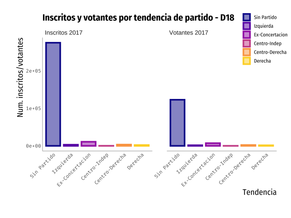
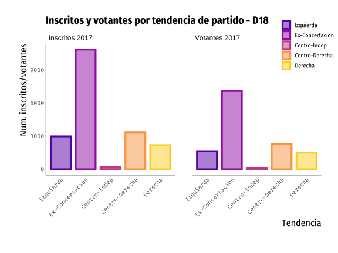
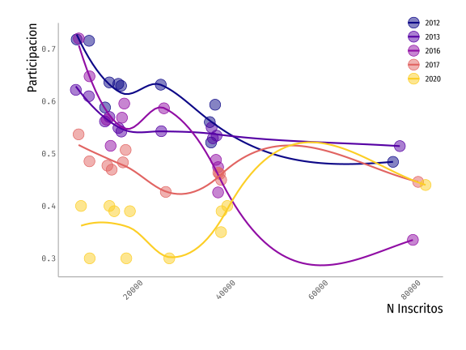

# Caracterización por edad Distrito 18

---
# Distribución de partidos políticos

---
# Distribución de partidos políticos: Solo militantes

---
background-position: 50% 50%
class: left, bottom, inverse
.big[
Mapas de participación electoral 2012-2020
]
---
# Mapa participación electoral por año: 2020

.pull-left[
preserveda983ae06682a7d9
]
.pull-right[
- La región del Maule en general votó menos que en el 2017.

- Linares, Cauquenes, Parral y San Javier son las comunas con más inscritos.

- **Linares** es la comuna con **mayor** % de votación en 2020.

- **Retiro, Longaví,** y **Chanco** son las con **menor** participación en el plebiscito.
]

---
# Mapa participación electoral por año: 2017

.pull-left[
preservea22e0d3477401cd8
]
.pull-right[
- En general, participación más alta que el 2020.

- **Pelluhue** es la comuna con **mayor** % de votación en 2017.

- **Linares** tiene una participación del 44% (muy parecida al plebiscito 2020).
]

---
# Mapa participación electoral por año: 2016

.pull-left[
preserve8a5a10e964d4995c
]
.pull-right[
- Comunas más chicas votaron más que comunas más grandes.

- **Pelluhue** es la comuna con **mayor** % de votación en 2016.

- **Linares** tiene una participación **baja** comparada con el resto de las comunas.
]

---
# Mapa participación electoral por año: 2013

.pull-left[
preserve9e9775454527a495
]
.pull-right[
- La **participación era mucho mayor** el 2013 que en años siguientes, entre 50% y 60% para la mayoría de las comunas.

- **Linares** y **Cauquenes**, las dos comunas con mayor % de inscritos, tienden a tener menor participación que el resto.
]

---
# Mapa participación electoral por año: 2012
.pull-left[

preservebbf78366cd269479
]
.pull-right[
- La **mayor participación en el periodo 2012-2020** es este año.

- **Linares** igual era la comuna con menor participación.
]

---
# Participación según número de votantes: 2020

.pull-left[

]
.pull-right[
- En la mayoria de las elecciones, **comunas más chicas votaban más**.

- El 2017, la participación se estabilizó, independiente del tamaño de la comuna.

- Para el **plebiscito 2020**, comunas más grandes votaron más que las más pequeñas

]
---
background-position: 50% 50%
class: left, bottom, inverse
.big[
Evolución de votaciones según tendencia política
]

---
# Votación en el plebiscito (% Apruebo)

preservec4946aec26a83a8b

---
# Votación en el plebiscito (N Apruebo)

preserveea5623a63ca768cc

---
# Elección COREs 2017 (%)

preserve4b9384b0863437e1

---
# Elección COREs 2017 (Num. Votos)

preserve2ad1fbb4be59e1db

